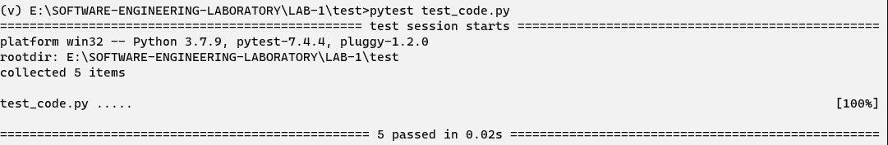

# Unit Testing with Pytest

### Write and execute unit tests for python functions using pytest framework, covering diferent test cases and assertions

> First created the folder for project that has 2 subdirectories `src` and `test`.
> Inside `src` folder created `source_code.py` that contaions the functions that are to be tested.
> Inside `test` folder created `test_code.py` (it is recommended that naming of test file should be `test_` followed by the filename which is to be tested)
> written functions and testing codes inside the files.
> Created an virtual python environment activated it and install `pytest` library
> The output of below is stored in `install.out`

```python
pip install -U pytest > install.out
```
> Then run the following command in `test` subdirectory and got the following result.

